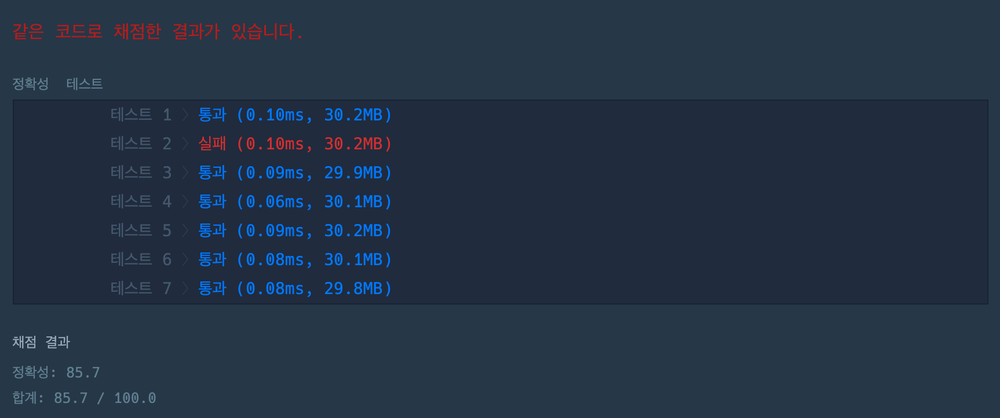

# [프로그래머스] K번째 수

[문제 보기](https://programmers.co.kr/learn/courses/30/lessons/42748)

### 나의 풀이

```js
function solution(array, commands) {
	return commands.map(command => {
		let start = command[0] - 1;
		let end = command[1];
		let idx = command[2] - 1;
		return array.slice(start, end).**sort((a, b) => a - b)**[idx];
	});
}
```

### 알게된 것

숫자를 정렬하기위해 sort 함수를 `compareFuction` 값 없이 사용해 정확성 테스트에서 실패가 떴다.


### 실패의 이유와 `Array.sort((a, b) => a - b)` 를 사용한 이유

sort 함수는 문자열의 유니코드 포인트를 따라 정렬하기 때문에 `compareFunction` 값이 제공되지 않으면 숫자를 문자열로 비교해서 정렬하게된다. 때문에 sort 함수에 정렬순서를 정의해주면 숫자를 반환할 수 있다.

[MDN - Array.prototype.sort](https://developer.mozilla.org/ko/docs/Web/JavaScript/Reference/Global_Objects/Array/sort)

우리가 MDN 문서를 정독해야 하는 이유이다.
